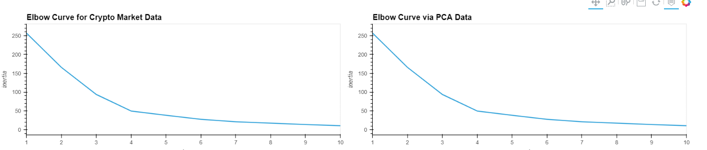
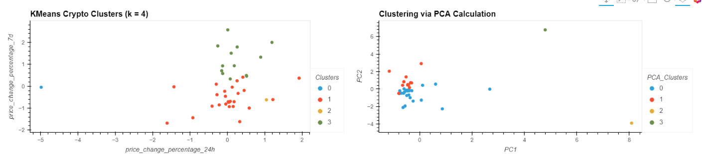

# Crypto-Investment-Portfolio
UW Fintech Module 10 Challenge

---

## Technologies

The following libraries are used in this analysis:  
  
  * pandas  
  * path
  * hvplot
  * sklearn.cluster (KMeans)  
  * sklearn.decomposition (PCA)
  * sklearn.preprocessing (StandardScaler)
  
---

## Purpose of Program

We have been tasked with analyzing a portfolio of Crypto currencies, and their price changes over time.  In order to make the analysis relevant, we utilize the StandardScaler function to make sure the data is similar, and the we condued KMeans and PCA analysis (via the elbow method to determine the clustering).  All this helps with unsupervised learning where the computer is looking for trends without guidance from us.
  
To skills demonstrated include:  
  
  * import csv files and create DataFrames  
  * use elbow method to find best k value 
  * plot data clusters based on chosen k value
  * optimize clusters via Principal Component Analysis
  * find k values using PCA
  * visualize and compare results

---

## Conclusions

Through this exercise, I have discovered the power of unsupervised learning.  In both the original and PCA data when we conduct analysis via the elbow method, it is apparent that 4 is the appropriate number of clusters: 
 
 
 
 
However, when we analyze the clusterin of the data, we do find that by utilizing the PCA method we get much tighter clusters, which will help the data be more relevant:
  
  
  
Overall I can certainly see the value to this type of unsupervised learning to identify areas for further analysis.  

---

## Contributors

The majority of this project has been done independently, with support from my tutor, Katy Kirby

---

## License

Program is free to use without license.  Only request is that you notify author of use and application.
  
To discuss usage or general inquires please contact the author at jonm5214@gmail.com

